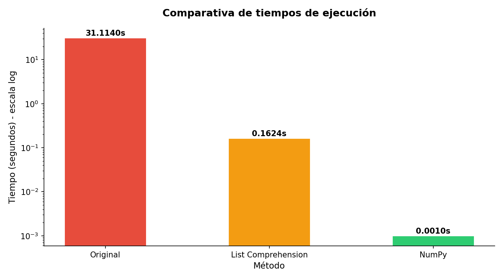
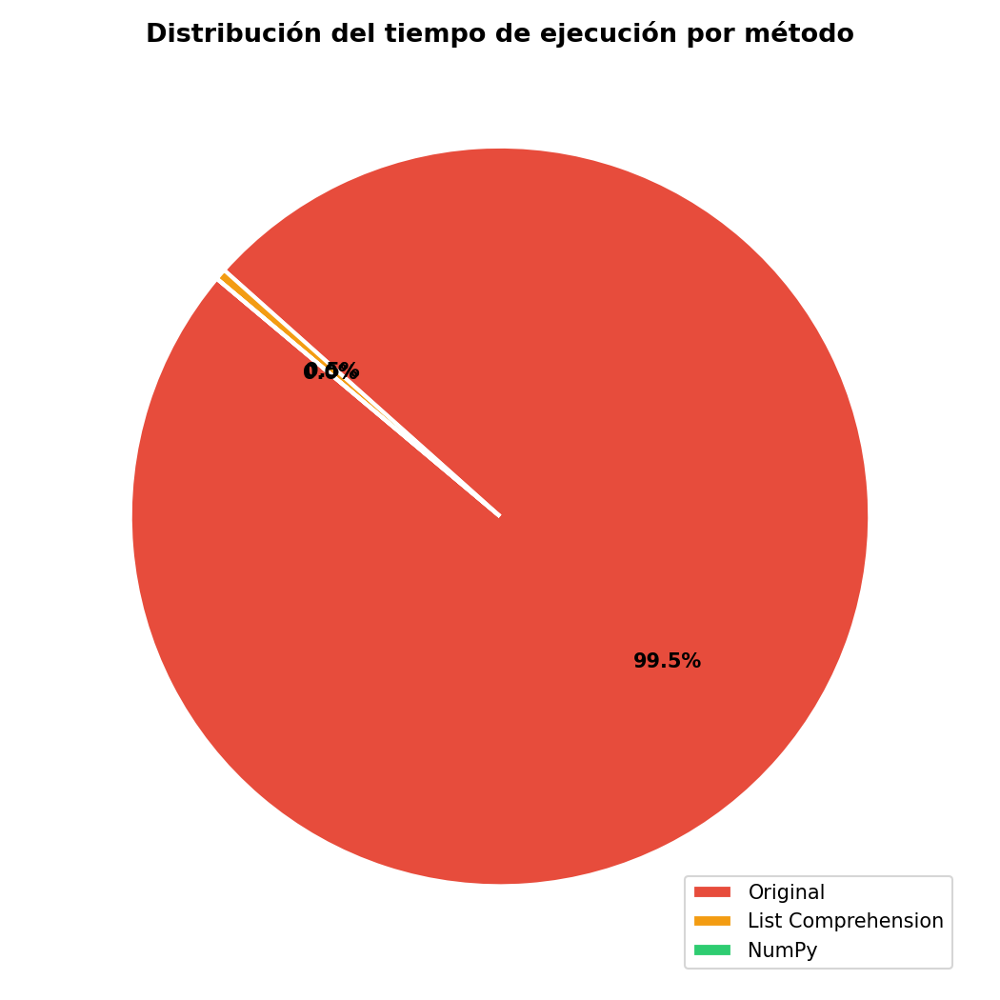
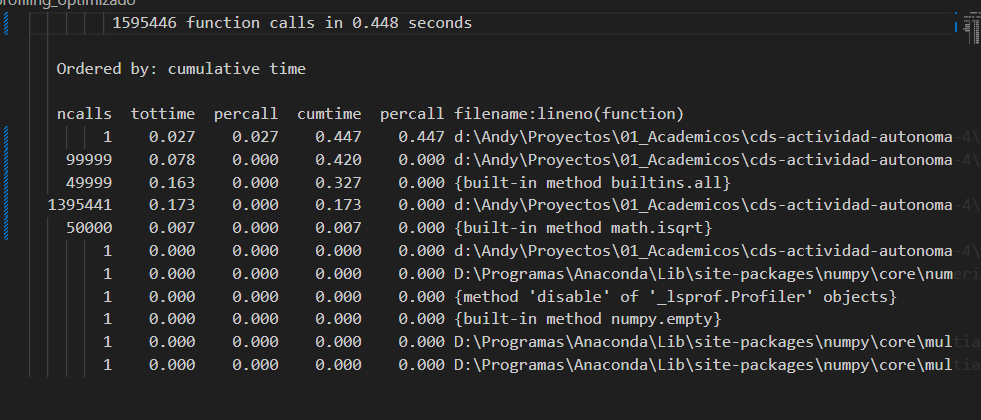

# Documentación Técnica: Optimización de Código y Medición de Tiempos

**Autor:** Andrés Nevárez  
**Repositorio:** [optimizacion-primos](https://github.com/AndyNeva/optimizacion-primos)

---

## 1. Introducción

El presente proyecto tiene como objetivo aplicar técnicas de optimización y buenas prácticas de programación para mejorar la eficiencia de un código Python que busca números primos en el rango de 1 a 100 000. Se midieron los tiempos de ejecución antes y después de la optimización utilizando la biblioteca `time` y la herramienta de profiling `cProfile`.

### Código original y problemas identificados

El código original (`codigo_original.py`) implementa una función `es_primo()` que verifica si un número es primo iterando desde 2 hasta n - 1. Este enfoque presenta tres problemas principales de rendimiento:

1. **Iteración completa hasta n:** Para cada número se realizan hasta n - 2 comparaciones, cuando matemáticamente solo es necesario iterar hasta su raíz cuadrada √n (Raji, 2021). Esto genera una complejidad de O(n²) innecesaria.
2. **Uso de append en bucle:** La lista de primos se construye elemento por elemento con `.append()`, lo cual es menos eficiente que una list comprehension.
3. **Sin uso de NumPy:** Todas las operaciones se realizan en Python puro, sin aprovechar operaciones vectorizadas de bajo nivel.

Estos problemas resultan en un tiempo de ejecución de aproximadamente **31s** para el rango completo de 100 000 números.

---

## 2. Optimización

Se implementaron tres técnicas de optimización en el archivo `codigo_optimizado.py`, divididas en dos métodos distintos.

### 2.1. Reducción del rango con raíz cuadrada

En la función `es_primo_optimizado()`, el bucle ahora itera solo hasta √n en lugar de hasta n. Esto se basa en el principio matemático de que si n no tiene divisores menores o iguales a √n, entonces no tiene divisores en absoluto (Raji, 2021). 

### 2.2. List comprehensions

En la función `encontrar_primos_comprehension()`, la construcción de la lista de primos se realiza en una sola expresión de comprensión, eliminando el bucle explícito con `.append()`. Esto reduce la ssobrecarga de Python por llamada a función y hace el código más legible y pythónico según PEP 8.

### 2.3. NumPy (Criba de Eratóstenes)

La función `encontrar_primos_numpy()` implementa la **Criba de Eratóstenes** utilizando un array booleano de NumPy. En este array, cada posición representa un número y todos inician en `True` (primo). Posteriormente, se reccorre el array y se marcan como `False` los números que son múltiplos de algún primo anterior (O'Neill, 2009). La operación clave es:

```python
es_primo[i * i :: i] = False
```

Esta línea marca todos los múltiplos de `i` desde `i²` en una sola operación vectorizada, sin necesidad de un bucle Python. NumPy ejecuta esto internamente en C, lo que elimina la sobrecarga de Python y acelera  el proceso.

---

## 3. Resultados

### 3.1. Comparativa de tiempos

| Método | Rango evaluado | Tiempo de ejecución | Mejora vs original |
|---|---|---|---|
| Original | 1 — 100,000 | ~31.11 segundos | — |
| List comprehension + √n | 1 — 100,000 | ~0.16 segundos | ~194× más rápido |
| NumPy (Criba de Eratóstenes) | 1 — 100,000 | ~0.001 segundos | ~31,110× más rápido |

*Los valores de la tabla muestran una mejora muy significativa en el rendimiento del programa.*

El código original tardó aproximadamente **31.11s** en encontrar todos los números primos entre 1 y 100 000. Esto significa que el usuario debía esperar medio minuto para obtener el resultado, lo cual es poco práctico para una tarea relativamente sencilla.

Al optimizar la función para verificar divisores solo hasta la raíz cuadrada del número y utilizar una List Comprehension, el tiempo se redujo a **0.16s**. En otras palabras, el programa pasó de tardar medio minuto a ejecutarse en una fracción de segundo. Esta mejora de **194 veces** demuestra que pequeños cambios en la lógica del algoritmo pueden generar grandes beneficios.

La versión implementada con NumPy y la Criba de Eratóstenes fue todavía más eficiente, con un tiempo cercano a **0.001s**. Esto equivale a aproximadamente **31 mil veces** más rápido que la versión original. En la práctica, el resultado se obtiene de forma casi instantánea.

Estas mejoras son importantes porque permiten:

- Reducir considerablemente el tiempo de espera del usuario.
- Procesar rangos de números mucho más grandes.
- Aprovechar mejor los recursos del computador.
- Escalar el programa a problemas más complejos.


### 3.2. Gráficas comparativas

**Comparativa de tiempos de ejecución (escala logarítmica)**



La gráfica de barras utiliza escala logarítmica en el eje vertical, lo cual es una decisión metodológica necesaria. En escala lineal, las barras de List Comprehension y NumPy serían prácticamente invisibles frente al original. La escala logarítmica permite que cada orden de magnitud ocupe el mismo espacio visual, haciendo comparables valores tan dispares como **31.11s** y **0.001s** en una misma gráfica.


**Distribución del tiempo de ejecución por método**



El gráfico de pastel muestra que el método original consume el **99.5%** del tiempo total acumulado de los tres métodos, mientras que List Comprehension y NumPy juntos representan apenas el **0.5%** restante. Esto evidencia que el costo computacional del algoritmo inicial es muy superior al de las versiones mejoradas.

### 3.3. Análisis de cProfile

El archivo `profiling_optimizado.txt` generado por `cProfile` permite identificar en qué partes del programa se emplea la mayor cantidad de tiempo (Python Software Foundation, 2026). En este análisis, se puede evidenciar como las funciones con mayor tiempo acumulado son `encontrar_primos_comprehension` y `es_primo_optimizado`, lo cual es esperado ya que la verificación individual por número es una operación que se repite miles de veces. En contraste, `encontrar_primos_numpy` aparece con un tiempo prácticamente imperceptible. Esto ocurre porque las operaciones se ejecutan internamente en código compilado, evitando la sobrecarga de los bucles de Python.


 
En total, el programa realizó **1,595,446 llamadas** a funciones y completó su ejecución en **0.248s**, lo que confirma que, incluso con un elevado número de operaciones, el tiempo total puede mantenerse muy bajo cuando se emplea una estrategia eficiente. 

---

## 4. Conclusiones

Los resultados obtenidos demuestran que la optimización de código puede transformar por completo el desempeño de un programa.

La primera mejora, consistente en evaluar divisores solo hasta la raíz cuadrada del número, redujo el tiempo de ejecución de **31.11s** a **0.16s**. Esto evidencia que comprender la lógica matemática del problema permite eliminar operaciones innecesarias y obtener mejoras sustanciales con cambios relativamente simples.

La implementación de la Criba de Eratóstenes con NumPy llevó esta optimización aún más lejos, logrando que el mismo proceso se ejecute en aproximadamente **0.001s**. Este resultado confirma que seleccionar un algoritmo adecuado tiene un impacto mucho mayor que realizar ajustes menores en el código.

Además del incremento en velocidad, el proyecto permitió aplicar buenas prácticas de programación como el uso de funciones bien definidas, documentación y medición de tiempos. Esto facilita la comprensión, reutilización y mantenimiento del software.

En conclusión, este trabajo demuestra que la eficiencia de un programa depende principalmente de la estrategia utilizada para resolver el problema. Un algoritmo bien diseñado no solo reduce el tiempo de ejecución, sino que también hace posible abordar tareas de mayor tamaño de manera rápida y confiable.

---

## Referencias

- O'Neill, M. (2009). The genuine Sieve of Eratosthenes. *Journal of Functional Programming, 19*(1), 95–106. https://doi.org/10.1017/S0956796808007004
- Python Software Foundation. (2026). *The Python Profilers — cProfile*. Python 3 Documentation. https://docs.python.org/3/library/profile.html
- Raji, W. (2021). *The Sieve of Eratosthenes*. En Elementary Number Theory. LibreTexts Mathematics. https://math.libretexts.org/Bookshelves/Combinatorics_and_Discrete_Mathematics/Elementary_Number_Theory_(Raji)/02:_Prime_Numbers/2.01:_The_Sieve_of_Eratosthenes